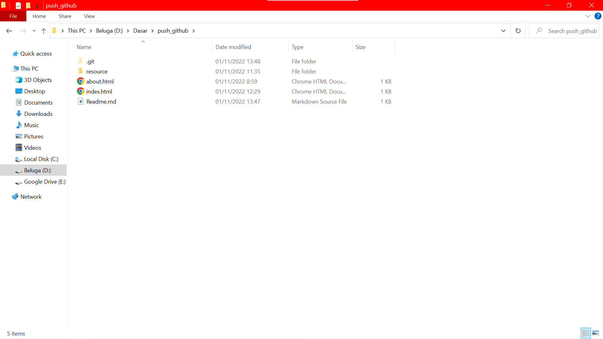

<h1>Cara Upload file/folder local ke github</h1>
 
<ol>
<li>Buat repository baru di github dan copy link https

</li>
<li>Pilih folder dimana tempat file dan foldernya akan diupload ke github.</li>

<li>Klik kanan dan pilih git bash</li>

<li>ketik di dalam git bash
   
    git init
    git add .
    git commit -m "message"
    git remote add origin https://github.com
    git push -u origin master
</li>
<li>Jika sudah periksa refresh github untuk melihatnya</li>
</ol>
  
<h5>Note : jika belum login git maka login terlebih dahulu dengan command </h5>

    git config --global user.email "example.gmail.com"
    git config --global user.name "example username"
